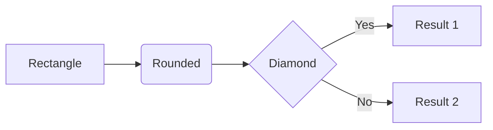
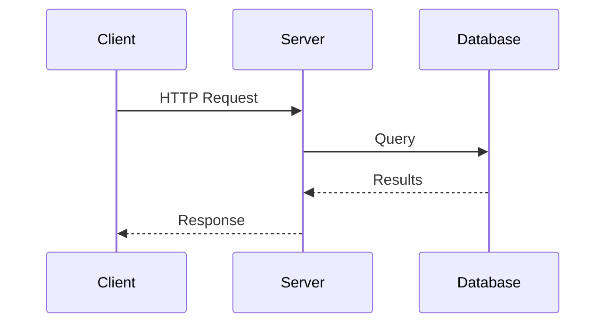

# Mermaid Terminal Renderer

Render Mermaid diagrams as Unicode ASCII art directly in the terminal.

## Platform Support

This skill works on **Linux**, **macOS**, and **Windows**. Check the `Platform` value in your environment context to determine which scripts to use:

| Platform | Shell | Scripts |
|----------|-------|---------|
| `linux` | Bash | `scripts/*.sh` |
| `darwin` | Bash | `scripts/*.sh` |
| `win32` | PowerShell | `scripts/*.ps1` |

## IMPORTANT: Keep Diagrams Simple

The mermaid-ascii renderer has limitations. Complex diagrams will fail to render. Follow these strict constraints:

### Hard Limits
- **Maximum 8 nodes** per diagram - fewer is better
- **Maximum 10 edges** per diagram
- **No subgraphs** - they don't render reliably
- **No styling/classes** - not supported
- **Short labels only** - keep node text under 20 characters
- **Avoid special characters** in labels (quotes, brackets, etc.)

### What Works Well
- Simple linear flows: `A --> B --> C --> D`
- Small decision trees with 1-2 branches
- Basic sequences with 3-4 participants
- Flowcharts with clear, minimal structure

### What Will Fail
- Architectures with 10+ components
- Diagrams with many crossing edges
- Nested subgraphs
- Long descriptive labels
- Complex styling or theming

### When a Diagram Is Too Complex
If you need to show a complex system, **split it into multiple simple diagrams** instead of one large one. For example:
- Show high-level overview in one diagram (3-5 boxes)
- Show detailed subsystems in separate diagrams

Always err on the side of simplicity. A rendered simple diagram is better than a failed complex one.

## When to Create Diagrams

Create a diagram when explaining:

- **Processes/Workflows**: Step-by-step procedures, CI/CD pipelines, approval flows
- **Architecture**: System components, service relationships, module dependencies
- **Sequences**: API calls, user interactions, message flows between services
- **Data Flow**: ETL pipelines, request/response cycles, event propagation
- **State Machines**: Status transitions, lifecycle stages
- **Decision Trees**: Conditional logic, branching paths

Trigger phrases: "how does X work", "walk me through", "explain the flow", "show me how", "describe the process", "visualize", "diagram", "map out"

## Rendering a Diagram

1. Write mermaid syntax to a temp file
2. Run the render script for your platform

### Linux/macOS (Bash)

```bash
# Write diagram to file
cat > /tmp/diagram.mermaid << 'EOF'
graph LR
    A[Start] --> B[Process]
    B --> C[End]
EOF

# Render it
bash scripts/render_mermaid.sh /tmp/diagram.mermaid
```

Or pipe directly:

```bash
echo 'graph LR; A-->B-->C' | bash scripts/render_mermaid.sh -
```

### Windows (PowerShell)

```powershell
# Write diagram to file
@'
graph LR
    A[Start] --> B[Process]
    B --> C[End]
'@ | Out-File -FilePath "$env:TEMP\diagram.mermaid" -Encoding UTF8

# Render it
powershell scripts/render_mermaid.ps1 "$env:TEMP\diagram.mermaid"
```

Or pipe directly:

```powershell
'graph LR; A-->B-->C' | powershell scripts/render_mermaid.ps1 -
```

## Mermaid Syntax Reference

### Flowcharts (graph)



Directions: `LR` (left-right), `RL`, `TD`/`TB` (top-down), `BT` (bottom-top)

Node shapes:
- `[text]` - Rectangle
- `(text)` - Rounded
- `{text}` - Diamond/decision
- `([text])` - Stadium
- `[[text]]` - Subroutine

Edges:
- `-->` - Arrow
- `---` - Line
- `-->|label|` - Labeled arrow
- `-.->` - Dotted arrow

### Sequence Diagrams



Arrow types:
- `->>` - Solid arrow
- `-->>` - Dotted arrow
- `-x` - Cross (failure)

## Examples

### API Request Flow

**Linux/macOS:**
```bash
cat > /tmp/api.mermaid << 'EOF'
sequenceDiagram
    participant U as User
    participant A as API
    participant DB as Database

    U->>A: POST /users
    A->>DB: INSERT user
    DB-->>A: user_id
    A-->>U: 201 Created
EOF

bash scripts/render_mermaid.sh /tmp/api.mermaid
```

**Windows:**
```powershell
@'
sequenceDiagram
    participant U as User
    participant A as API
    participant DB as Database

    U->>A: POST /users
    A->>DB: INSERT user
    DB-->>A: user_id
    A-->>U: 201 Created
'@ | Out-File "$env:TEMP\api.mermaid" -Encoding UTF8

powershell scripts/render_mermaid.ps1 "$env:TEMP\api.mermaid"
```

### Git Workflow

**Linux/macOS:**
```bash
cat > /tmp/git.mermaid << 'EOF'
graph LR
    A[feature branch] --> B[open PR]
    B --> C{review}
    C -->|approved| D[merge]
    C -->|changes requested| E[update]
    E --> C
    D --> F[deploy]
EOF

bash scripts/render_mermaid.sh /tmp/git.mermaid
```

**Windows:**
```powershell
@'
graph LR
    A[feature branch] --> B[open PR]
    B --> C{review}
    C -->|approved| D[merge]
    C -->|changes requested| E[update]
    E --> C
    D --> F[deploy]
'@ | Out-File "$env:TEMP\git.mermaid" -Encoding UTF8

powershell scripts/render_mermaid.ps1 "$env:TEMP\git.mermaid"
```

### CI/CD Pipeline

**Linux/macOS:**
```bash
cat > /tmp/cicd.mermaid << 'EOF'
graph LR
    A[Push] --> B[Build]
    B --> C[Test]
    C --> D{Pass?}
    D -->|Yes| E[Deploy Staging]
    D -->|No| F[Notify]
    E --> G[Integration Tests]
    G --> H{Pass?}
    H -->|Yes| I[Deploy Prod]
    H -->|No| F
EOF

bash scripts/render_mermaid.sh /tmp/cicd.mermaid
```

**Windows:**
```powershell
@'
graph LR
    A[Push] --> B[Build]
    B --> C[Test]
    C --> D{Pass?}
    D -->|Yes| E[Deploy Staging]
    D -->|No| F[Notify]
    E --> G[Integration Tests]
    G --> H{Pass?}
    H -->|Yes| I[Deploy Prod]
    H -->|No| F
'@ | Out-File "$env:TEMP\cicd.mermaid" -Encoding UTF8

powershell scripts/render_mermaid.ps1 "$env:TEMP\cicd.mermaid"
```

## Automatic Width Adjustment

The renderer automatically detects your terminal width and adjusts spacing to fit. It:

1. Analyzes diagram complexity (node count, label lengths, flow direction)
2. Calculates optimal spacing for your terminal width
3. If still too wide after minimum spacing, shows a note suggesting `less -S`

This means diagrams render well across different terminal sizes and zoom levels without manual adjustment.

## Render Options

**Linux/macOS:**
```bash
# Override auto-spacing with manual values
bash scripts/render_mermaid.sh diagram.mermaid -x 8 -y 3

# More padding in boxes
bash scripts/render_mermaid.sh diagram.mermaid -p 2

# Pure ASCII (no Unicode)
bash scripts/render_mermaid.sh diagram.mermaid --ascii
```

**Windows:**
```powershell
# Override auto-spacing with manual values
powershell scripts/render_mermaid.ps1 diagram.mermaid -x 8 -y 3

# More padding in boxes
powershell scripts/render_mermaid.ps1 diagram.mermaid -p 2

# Pure ASCII (no Unicode)
powershell scripts/render_mermaid.ps1 diagram.mermaid -ascii
```
